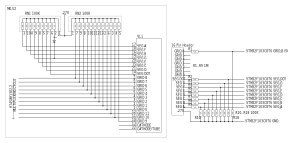
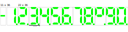

<!-- omit in toc -->
# Elektronika MK-52 (Электроника MK-52) VFD Scanner for OLED display
[MK-52 Elektronika](https://en.wikipedia.org/wiki/Elektronika_MK-52) VFD Scanner for OLED Display

- [Used components](#used-components)
- [Command line](#command-line)
- [Pinouts, wiring and output](#pinouts-wiring-and-output)
- [Reference](#reference)

# Used components

* Elektronika MK-52, 1990, bad display
* Elektronika MK-52, 1993, working display for tests
* SMT32F103C8T6 (Robodyn Bluepill) to scan MK-52 VFD
* 256x64 SH1122 based OLED to replace MK-52 VFD
* B0505S-1W Isolating DC-DC

So we can go from this (the minus sign and the first digit '1' are almost invisible in real life):


to this:


and finaly to this:


# Command line

Serial terminal can be connected at 38400 baud, the following commands are supported:

```
> help
UID: 066FFF38-3739574D-FFFFFFFF
Running at: 72000000
Version: 2021-06-26
Commands:
    reset
    info
    print scan on|off
    print hex on|off
    print key on|off
    oled on|off
    oled reset
    oled clear [$color]
    oled font $color_value
    oled print $str
    oled line $start_line
    oled rotate on|off
```

Image size:

```
   text    data     bss     dec     hex filename
  20660     120    7408   28188    6e1c build/mk-52.elf
```

# Pinouts, wiring and output

Original HAL code generated by STM32Cume-MX in some cases was replaced with simple CMSIS registers manipulation.

STM32CubeMX Pinout View:


Robodyn Bluepill Pinout View:


ИЛЦ2-12/8Л VFD Pinout:


Wiring used for debugging:



VFD Multiplexing Scan Cycle:


Serial Port output for ``12 x 4 = 48; 0 / 0 = ЕГГОГ; BП; Е.ГГОГ; B↑; .``:


Font sketchup:



Remember not to divide by zero, or you get:


# Reference

[Making Elektronika MK-52 VFD scanner](http://achilikin.blogspot.com/2021/05/making-elektronika-mk-52-vfd-scanner.html)

[Making OLED Display for Elektronika MK-52](http://achilikin.blogspot.com/2021/06/making-oled-display-for-elektronika-mk.html)

[Infiltration into the Elektronika MK-52 Architecture](https://habr.com/ru/post/467501/)

[MK-61 Emulation](https://pmk.arbinada.com/mk61emuweb.html#_%D0%9C%D0%9A-61)

[Some experiments with hacking the ЭЛЕКТРОНИКА МК-61](http://www.alfredklomp.com/technology/mk-61/)

[Elektronika MK-52 by Guillaume Tello](https://gtello.pagesperso-orange.fr/elektronika_e.htm)


