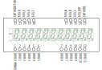

<!-- omit in toc -->
# Elektronika MK-52 (Электроника MK-52) VFD Scanner
[MK-52 Elektronika](https://en.wikipedia.org/wiki/Elektronika_MK-52) Display Scanner

- [Used components](#used-components)
- [Pinouts, wiring and output](#pinouts-wiring-and-output)
- [Reference](#reference)

# Used components

* Elektronika MK-52, 1990, bad display
* Elektronika MK-52, 1993, working display
* SMT32F103C8T6 (Robodyn Bluepill)

# Pinouts, wiring and output

Original HAL code generated by STM32Cume-MX in some cases was replaced with simple CMSIS registers manipulation.

STM32CubeMX Pinout View:

Robodyn Bluepill Pinout View:

ИЛЦ2-12/8Л VFD Pinout:

Wiring used for debugging:

VFD Multiplexing Scan Cycle:

Serial Port output for ``12 x 4 = 48; 0 / 0 = ЕГГОГ; BП; Е.ГГОГ; B↑; .``:

# Reference

[Making Elektronika MK-52 VFD scanner](http://achilikin.blogspot.com/2021/05/making-elektronika-mk-52-vfd-scanner.html)

[Infiltration into the Elektronika MK-52 Architecture](https://habr.com/ru/post/467501/)

[MK-61 Emulation](https://pmk.arbinada.com/mk61emuweb.html#_%D0%9C%D0%9A-61)

[Some experiments with hacking the ЭЛЕКТРОНИКА МК-61](http://www.alfredklomp.com/technology/mk-61/)

[Elektronika MK-52 by Guillaume Tello](https://gtello.pagesperso-orange.fr/elektronika_e.htm)

